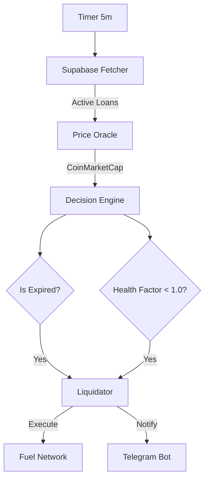

# Axios Liquidation Bot

> Autonomous liquidation bot for Axios Finance lending protocol on Fuel Network

## Overview

This bot monitors active loans on the Axios Finance platform and automatically executes liquidations when:
1. **Time-based**: Loan duration has expired
2. **Health Factor**: Collateral value falls below loan value threshold

## Features

- ✅ Real-time monitoring of active loans via Supabase
- ✅ TAI64 timestamp conversion for Fuel Network compatibility
- ✅ Health factor calculation using live price feeds
- ✅ Automatic liquidation execution on Fuel Network
- ✅ Telegram notifications for transparency
- ✅ Retry logic with exponential backoff
- ✅ Dry-run mode for testing
- ✅ Comprehensive logging
- ✅ Environment-agnostic deployment

## Architecture Overview
This bot is a **keeper** responsible for maintaining protocol solvency. It continuously monitors all active loans on the Fuel Network and liquidates any position that becomes undercollateralized or expired.



## How It Works

### 1. The Core Loop (Every 5 Minutes)
The bot wakes up on a set interval (`SCAN_INTERVAL_MS=300000`) and acts as a central decision engine. It does not blindly fire transactions; it follows a rigorous check-process.

### 2. Four-Step Process

#### **Step 1: Data Gathering (Indexer Sync)**
*   **Action**: Queries your **Supabase Indexer** (`loans` table).
*   **What it gets**: A list of all `active` loans, including their collateral amounts, loan amounts, and expiration timestamps.
*   *Why Indexer?* Querying the blockchain for "all loans" is slow/expensive. The indexer provides instant state access.

#### **Step 2: Oracle Price Check**
*   **Action**: Fetches real-time prices for assets (e.g., ETH, FUEL, USDC).
*   **Source**: **CoinMarketCap API** (with CoinGecko/Pyth as fallbacks).
*   **Caching**: Prices are cached for 30 seconds to save API credits and speed up processing.

#### **Step 3: Risk Analysis (The Decision Engine)**
For every active loan, it runs two checks locally:

1.  **⏰ Expiration Check**:
    *   Is `current_time > loan.ends_at`?
    *   **Yes** → Liquidate immediately (Time-based default).

2.  **📉 Health Factor Check**:
    *   Calculates: `Health Factor = (Collateral Value in USD) / (Loan Debt in USD)`
    *   Is `Health Factor < 1.0` (or `HEALTH_FACTOR_THRESHOLD`)?
    *   **Yes** → Liquidate immediately (Undercollateralized default).

#### **Step 4: Execution (On-Chain)**
If a loan fails a check:
1.  **Gas Check**: Verifies the bot's wallet has enough ETH.
2.  **Transaction**: Calls the `liquidate_loan(loan_id)` function on the Axios Smart Contract.
    *   *Note*: Sends the transaction via the Fuel SDK (`fuels`).
3.  **Retry Logic**: If the network is congested, it retries up to 3 times with exponential backoff.

### 3. Notifications
*   **Scan Complete**: Sent after each cycle
*   **Liquidation Event**: Sent for each liquidation
*   **Error Alert**: Sent on failures

## Development

### Adding Contract Integration

The contract interaction is currently a TODO. To implement:

1. Get the contract ABI
2. Update `src/liquidator.ts`:
   ```typescript
   import { Contract } from 'fuels';
   import contractAbi from './abi/loan-contract.json';
   
   const contract = new Contract(this.contractId, contractAbi, this.wallet);
   const tx = await contract.functions.liquidate_loan(loanId).call();
   await tx.waitForResult();
   ```

## Monitoring

### Health Check
The bot provides a health check endpoint (if HTTP server is added):
```json
{
  "isRunning": true,
  "walletBalance": "0.05",
  "lastScanTime": 1234567890
}
```

### Telegram Notifications
All events are logged to the configured Telegram group for transparency.

## Troubleshooting

### Bot not starting
- Check environment variables are set correctly
- Verify Supabase and Fuel RPC connectivity
- Check logs for detailed error messages

### No liquidations happening
- Ensure loans exist in database with `status = 'active'`
- Verify price API is responding
- Check health factor threshold configuration
- Enable `DRY_RUN=true` to test logic

### Telegram notifications not working
- Verify bot token and chat ID
- Ensure bot is added to the group
- Check bot has permission to send messages

